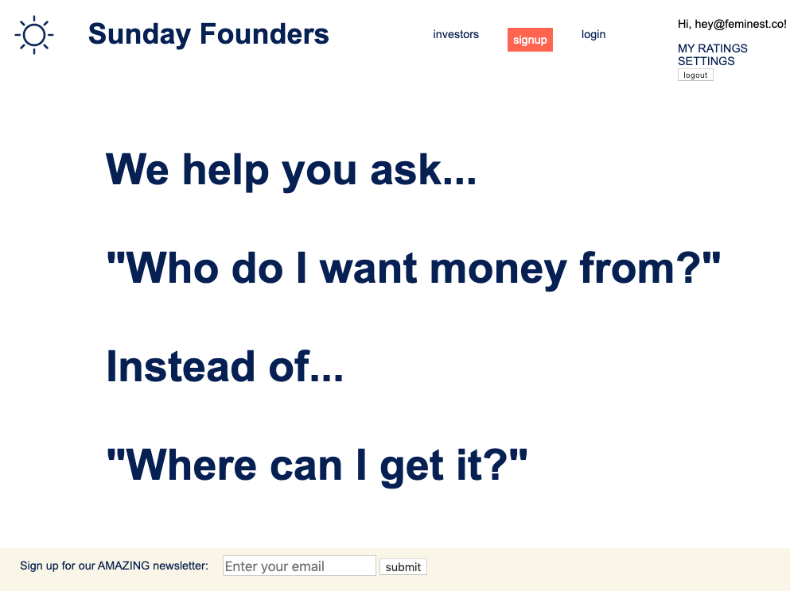
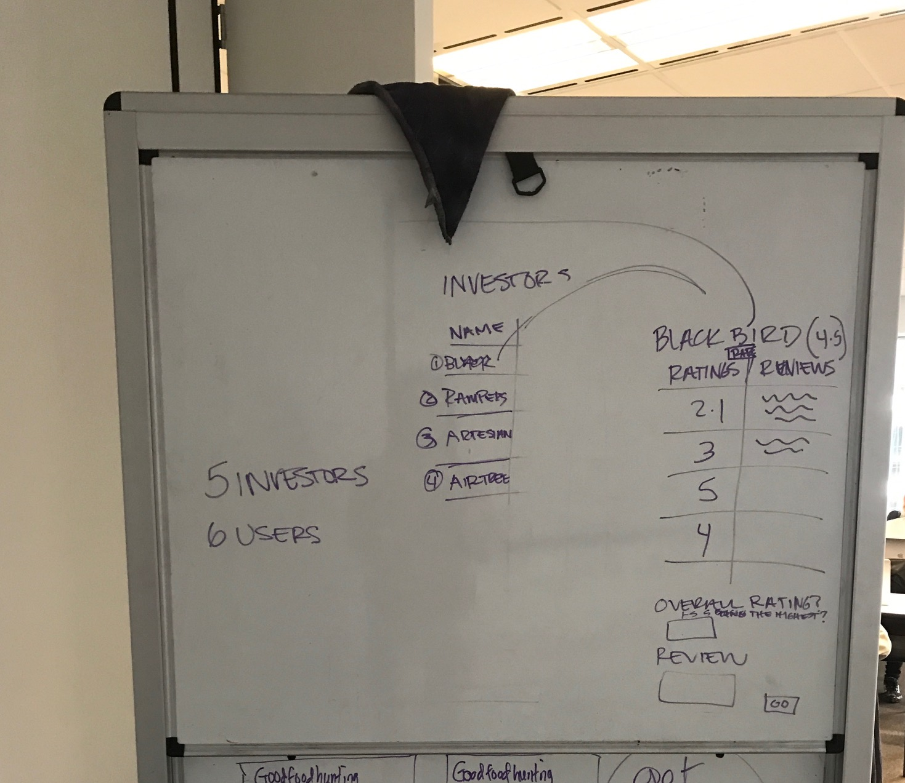
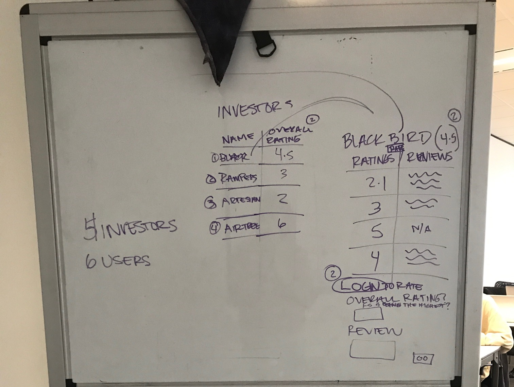
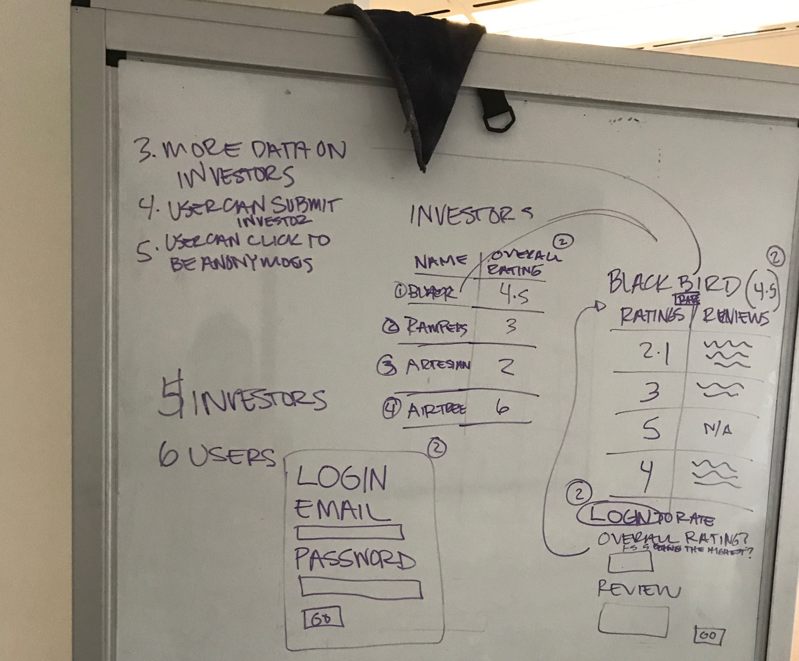
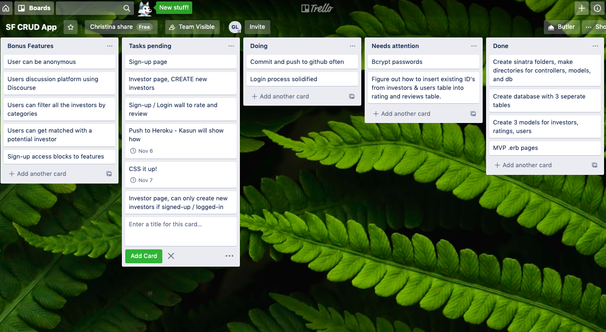

# Sunday Founders

[Sunday Founders Link](https://sunday-founders.herokuapp.com/){:target="\_blank"}

A CRUD Ruby app that's a transparency platform on investors for startup founders. A place for founders to get information, and rate and review their investors.

## User story

When growing a company an entrepreneur can come to a fork in the road where they need to decide whether or not they fundraise or bootstrap. Currently, the startup climate leans towards entrepreneurs to fundraise. However, if that founder isn't currently connected to the ecosystem, there is little to no information on investors. The investor world is a black box, that with some transparency will help both founders and investors improve behavior and educate themselves more. At a minimum, founders will want basic information on investors like fund-size, portfolio size, industries invested in. The most valuable information will be on the rating and reviews from other founders who have applied, pitched or received funding from these investors.

## Languages used

- Ruby
- Sinatra
- CSS

## Planning Process

### Choosing a CRUD idea

I was deciding between two CRUD apps, this one and Soapbox. Soapbox is a public speaker marketplace, where event organizers can book speakers that have signed-up. I decided to go with this one as the public speaker platform would require double sided login process and booking links to be functional. Sunday Founders only requires one login. I also care deeply about Sunday Founders as I believe it will help founders in the fundraising process.

### Creating wireframes

I wanted to see what an MVP could look like so I tried to strip down all the functions I wanted to just what I needed.

And then added on a login function:

Then added what features for version 3,4,5 could look like:

I then thought through what tables in my database I needed. I realized later that I would need 2 tables for investors. One that listed the investors, and another that would be multiple ratings and reviews for each investor, that tracked the investor id and the user id that submitted the rating. The third table would then be a user table.

I then created a [Figma wireframe](https://www.figma.com/file/EJrlAjbWp9QnHLmHJqmAgV/Sunday-Founders?node-id=0%3A1) to help visualize the layout.

### Creating trello board

[Trello board](https://trello.com/b/0jgVBBX2/sf-crud-app)

## Challenges

- Understanding how to get the three tables to talk to one another
- Login process and deciding what information I wanted the user to be able to see before signing-up.
- Looping through certain methods created and understanding arrays and hashes.

## Lessons learned

- Trello board was really fantastic to have. I created boards for needed features, bonus features, ones that needed immediate attention. This helped keep me focused.
- I also created pseudocode boards to help with creating new methods between the sql, models, controllers and erb files, this helped break down the flow of where I needed to update and change my code.
- Writing a user story was really nice to know how to prioritize information and features.

## Unsolved problems and bonus features

- Ability to search and filter investors based on certain criteria
- I would love to make a discussion platform feature eventually, possibly using [Discourse](https://www.discourse.org/), an open source plug-in.
- Have a seperate login for investors for specific types of interactin with users.
- Create a gamified element where users can move up to different community badge status's depending on how active they are in the community
- Overall, spend more time on CSS making the site more elegant
